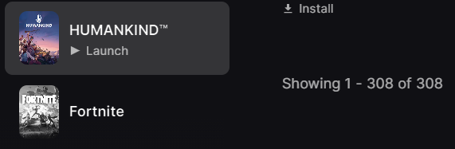
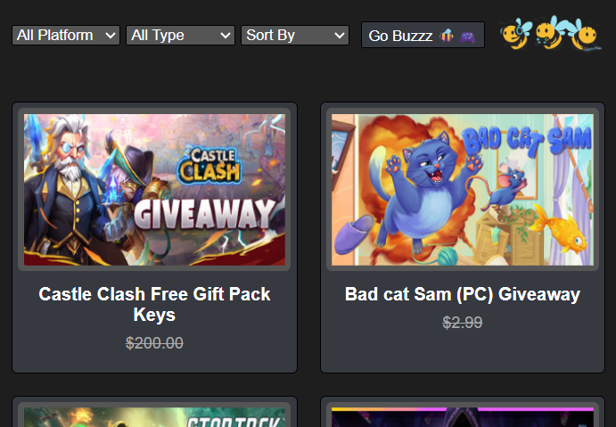

# 🐝 3Bees (Freebies)
 

##### README Disclaimer: *README.md is partially generated and formatted using AI*

---

**3Bees** is a web application that lets you discover and filter the latest free game giveaways 🎮.  
Built with **JavaScript (ES6 modules)**, **Axios**, and dynamic DOM rendering, it connects to the [GamerPower API](https://www.gamerpower.com/).  

## Why 🐝 **3Bees**?
- *Because I love giveaways! Nearly 98% of my game library comes from free giveaways — so I built 3Bees to help others discover and claim them easily.*
- *I also enjoyed the wordplay — *3Bees* sounds just like **Freebies** 🐝🎮*

 


## ✨ Features

- 🔎 **Filters** by platform, type, and sort order  
- 🖼️ **Dynamic card rendering** with image, title, and worth  
- 🌍 **Clickable cards** redirecting to the giveaway page  
- 📱 **Responsive layout** using CSS grid (auto-adjusts to screen size)  
- ⚡ Async API requests with `async/await` and Axios  
- 📂 Modular codebase:
  - `api-info.js` → API configuration  
  - `script.js` → API requests  
  - `dom.js` → DOM rendering  

## 🖼️ Screenshots

  


## 🛠️ Installation

Clone the repository:  
```bash
git clone https://github.com/your-username/3bees.git
cd 3bees
```
Install dependencies (if required):
```bash
npm install
```
Run locally:
```bash
# Use Live Server (VS Code) or any HTTP server
```

## ⚙️ Usage
- Select filters (platform, type, sorting).

- Click Go Buzzz 🐝🎮.

- Browse the latest giveaways with direct links.

## 📂 Project Structure
```bash
├── index.html       # main HTML file
├── style.css        # styling (responsive grid, cards)
├── api-info.js      # API configuration
├── script.js        # API logic
├── dom.js           # DOM manipulation
└── images/          # icons and logo
```

## ✅ Requirements Checklist

 - ✅ Use Axios to fetch external API

 - ✅ Interactive filters and dynamic gallery

 - ✅ Async/await and Promises

 - ✅ Modular code (3+ files)

 - ✅ Responsive design with CSS Grid

 - ✅ README with project description

